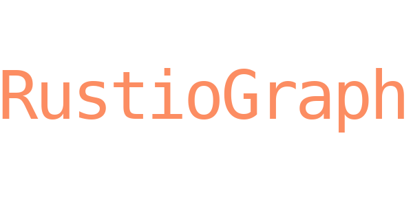

> [!WARNING]
> RustioGraph is currently in an early testing stage and may contain bugs or unexpected behavior.
>
> If you encounter a bug, unexpected behavior, or another issue, please open an [issue](https://github.com/kageiro/rustiograph/issues) and provide enough information to reproduce the problem.


A Rust library for interacting with the Telegra.ph API. RustioGraph provides a simple, high-level interface for managing accounts and pages, automating publications, and working with Telegra.ph content, while also exposing a low-level API for custom requests and access to newly introduced API methods that may not yet be supported by the library.

The project is currently in its early stages of development and may contain bugs or undergo breaking changes.

# Usage example
```rust,ignore
use rustiograph::prelude::*;

#[tokio::main]
async fn main() -> Result<(), Box<dyn std::error::Error>> {
    let mut telegraph = Rustiograph::new(None)?;
    let author_name = Some(AuthorName::new("Test name")?)

    telegraph
        .create_account(CreateAccount {
            short_name: ShortName::new("MyBot")?,
            author_name: author_name,
            author_url: None,
            auth: true,
        })
        .await?;

    println!("{:?}", telegraph.token());

    let page = telegraph
        .create_page(CreatePage {
            title: Title::new("Test Title")?,
            content: ContentInput::Html("<p>Hello</p>".into()),
            author_name: author_name,
            author_url: None,
            return_content: false,
            as_user: false,
        })
        .await?;

    Ok(())
}
```

[All examples >>](examples/)
